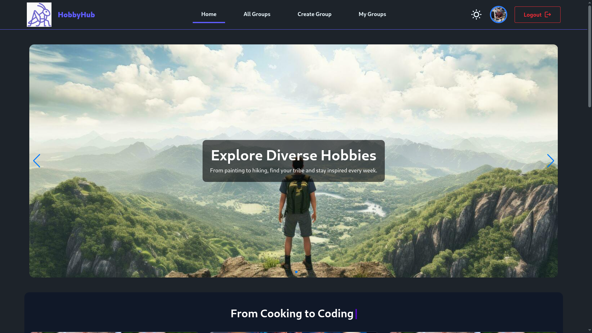

# React + Vite

This template provides a minimal setup to get React working in Vite with HMR and some ESLint rules.

Currently, two official plugins are available:

- [@vitejs/plugin-react](https://github.com/vitejs/vite-plugin-react/blob/main/packages/plugin-react) uses [Babel](https://babeljs.io/) for Fast Refresh
- [@vitejs/plugin-react-swc](https://github.com/vitejs/vite-plugin-react/blob/main/packages/plugin-react-swc) uses [SWC](https://swc.rs/) for Fast Refresh

## Expanding the ESLint configuration

If you are developing a production application, we recommend using TypeScript with type-aware lint rules enabled. Check out the [TS template](https://github.com/vitejs/vite/tree/main/packages/create-vite/template-react-ts) for information on how to integrate TypeScript and [`typescript-eslint`](https://typescript-eslint.io) in your project.

# 🎯 HobbyHub - Local Hobby Group Organizer

🌐 **Live Demo:** https://assignment-10-client-715c7.web.app/

## 🚀 Key Features

- 🔐 **Secure Auth System**  
  Firebase Authentication with Email/Password + Google Sign-in
- 🎨 **Dynamic UI**  
  TailwindCSS with dark/light theme toggle & React Awesome Reveal animations
- 📅 **Smart Group Management**  
  Create/update groups with start date validation & membership limits
- 📱 **Fully Responsive**  
  Mobile-first design optimized for all screen sizes
- 🤖 **Interactive Elements**  
  Typewriter effects, Swiper sliders, and React Tooltip integrations

## 💻 Tech Stack

| Category       | Technologies                        |
| -------------- | ----------------------------------- |
| **Frontend**   | React 19, React Router 7            |
| **Styling**    | Tailwind CSS 4, DaisyUI             |
| **Auth**       | Firebase Authentication             |
| **Animations** | React Awesome Reveal, React Tooltip |
| **Backend**    | Node.js, Express, MongoDB           |
| **Deployment** | Firebase Hosting + Vercel Server    |

## 🌟 Special Features

- ⏳ Start date validation for group participation
- 📊 Real-time group status indicators
- 🎭 Smooth page transitions with animations
- 📲 Progressive Web App capabilities
- 🔄 Context API for state management

> "Bridging passions through technology - HobbyHub makes local connections effortless"
